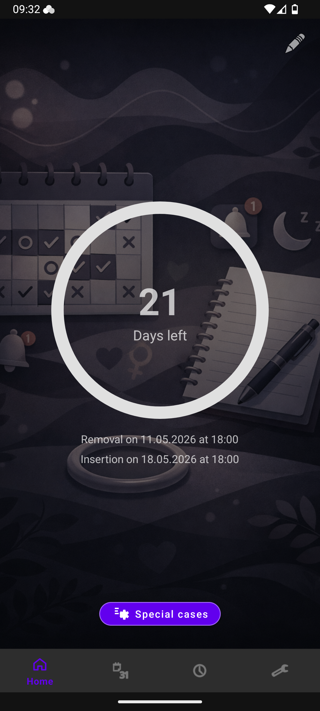
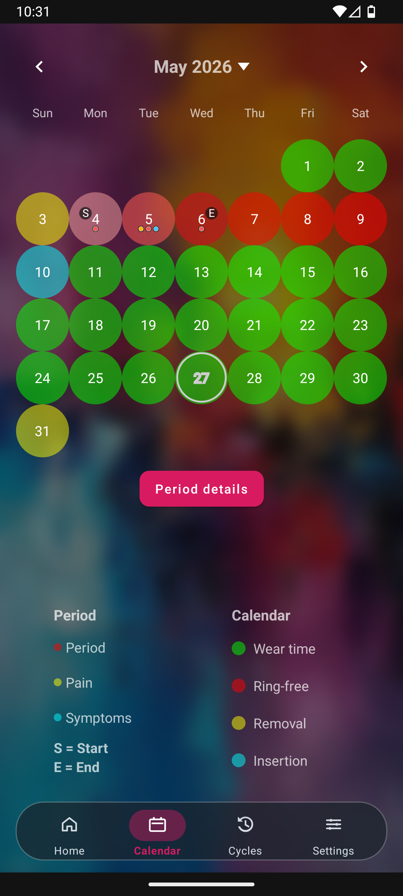
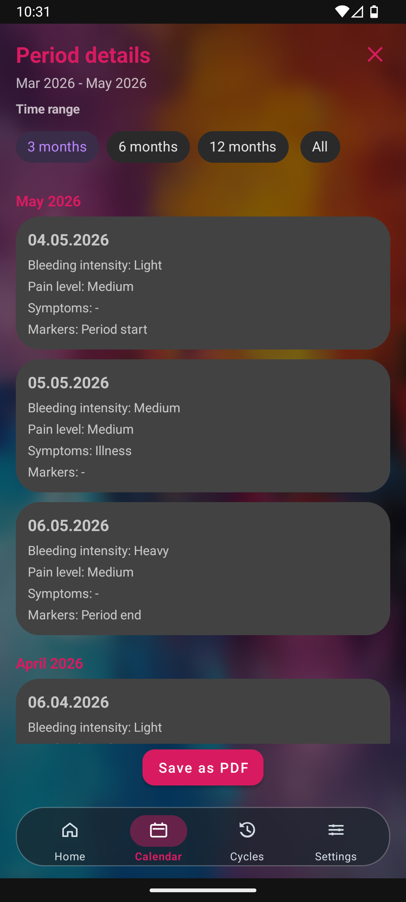
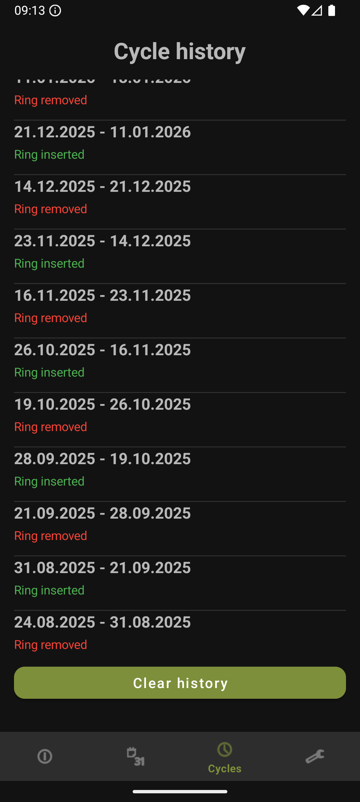
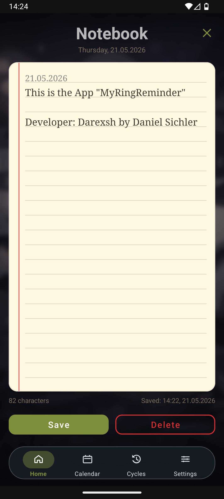
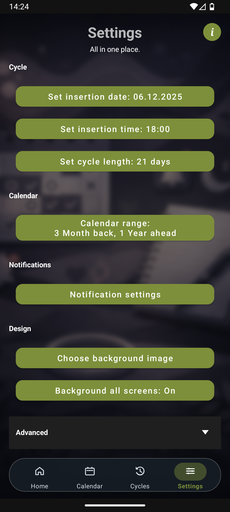
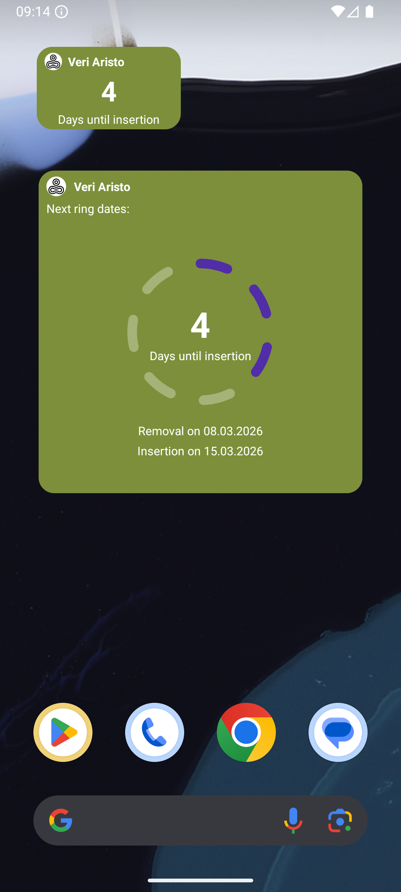
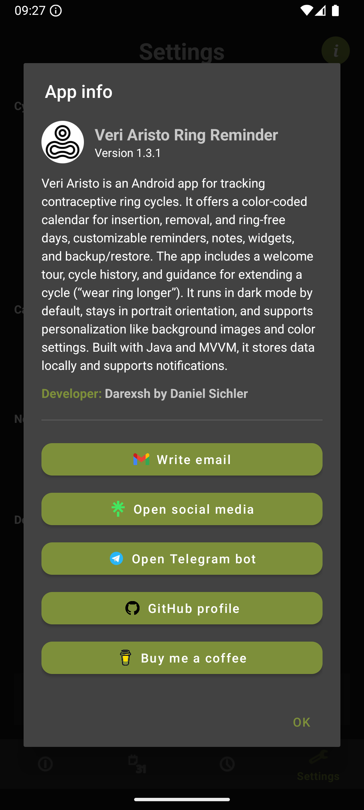

* * *

<div align="center">

📱 MyRingReminder
============================

**An Android app for tracking and managing contraceptive ring cycles**  
📅⏰📝🎨📊

  

[](https://t.me/darexsh_bot) [](https://buymeacoffee.com/darexsh)  
<sub>Get release updates on Telegram.<br>If you want to support more apps, you can leave a small donation for a coffee.</sub>

</div>


* * *

✨ Authors
---------

| Name | GitHub | Role | Contact | Contributions |
| --- | --- | --- | --- | --- |
| **[Darexsh by Daniel Sichler](https://github.com/Darexsh)** | [Link](https://github.com/Darexsh?tab=repositories) | Android App Development 📱🛠️, UI/UX Design 🎨 | 📧 [E-Mail](mailto:sichler.daniel@gmail.com) | Concept, Feature Implementation, Calendar & Reminder Logic, Notes Management, UI Design |

* * *

🚀 About the Project
==============

**MyRingReminder** is an Android app for managing and tracking contraceptive ring cycles. The app provides a color-coded calendar for insertion, removal, and ring-free days, customizable reminders, notes, widgets, and backup/restore features. It also includes a welcome tour, cycle history, and guidance for extending a cycle ("Wear ring longer"). Personalization options such as background images and color settings allow individual customization.

**Important note:** This app is intended solely for personal organization and cycle tracking. It is not a medical product, does not replace medical advice, and is not based on medical evaluation or diagnosis. If you have usage questions or health concerns, seek professional medical advice.

* * *

✨ Features
----------

* 📅 **Cycle Tracking**: Visualize insertion, removal, ring-free, and active days with color-coded calendar highlights; tap legend dots to recolor.

* 🩸 **Period Tracking (Ring-Free Window)**: Tap calendar days during ring-free week (and ±4 days) to add/edit period entries with bleeding intensity, pain level (light/medium/strong), additional symptoms (for example malaise, nausea, fatigue, dizziness, diarrhea), and optional start/end markers.

* 📄 **Period Details & PDF Export**: For months with period entries, open a dedicated **Period Details** view with range filters (3/6/12 months or all), grouped timeline, and export a formatted PDF report. After saving, a heads-up notification appears and opens the saved PDF directly when tapped.
    
* 🔔 **Reminders**: Custom reminder lead times for insertion/removal, with automatic rescheduling.
    
* 📝 **Notes**: Notebook-style notes with autosave, character counter, and quick delete.
    
* 🎨 **Customization**: Set cycle length, insertion date/time, calendar range, language, and background image. Customize button color, home ring color, and widget colors.

* 🎞️ **App Animations**: Choose a global navigation animation style in Settings (for tab switches and screen openings), including options such as slide, fade, zoom, rotate, pop, or none.

* ⚙️ **Animated Advanced Settings**: The **Settings → Advanced** section opens and closes with a subtle transition for smoother interaction.

* 🗓️ **Enhanced Calendar Navigation**: Navigate months with left/right arrows, tap the month header to jump directly to a selected month and year, and scroll through months without a fixed limit.

* 🌐 **Language Mode**: Select German, English, or **System Default**. System Default follows the device language and falls back to English if unsupported.

* 🔐 **App Lock**: Optional biometric/PIN app protection (default off) with a dedicated App Lock dialog to enable/disable protection and set auto-lock delay.

* 🌙 **Dark Mode (Default)**: App runs in dark mode by default, independent of system theme.

* 🔒 **Portrait Only**: Interface stays in vertical orientation for a consistent experience.
    
* 🧭 **Welcome Tour**: First-run guided tour across all screens, with a restart option in Settings → Advanced.

* 📊 **Cycle History**: Review past and upcoming cycles to track patterns and durations.

* ⏩ **Wear Ring Longer**: Extend the current cycle by extra days (per cycle), with built‑in info guidance.

* ⏭️ **Skip Ring-Free Week**: Skip the ring-free week for the current cycle (immediate reinsertion), then continue with normal cycle behavior afterward.

* 🧰 **Special Cases Menu (Home)**: Open quick actions for “Wear ring longer” and “Skip ring-free week” from a compact Home menu with auto-hide.

* 🧩 **Home Screen Widgets**: Small widget shows days left; large widget shows days left plus next dates, both color‑synced with app settings and resizable.

* 💾 **Backup / Restore**: One‑tap export and import of all settings and notes, with import validation and a user-friendly expandable review before confirming restore.

* 🛠️ **Debug View**: Long‑press settings title for detailed diagnostic information.
    

* * *

📸 Screenshots
--------------

<table>
  <tr>
    <td align="center"><b>Home Screen</b><br></td>
    <td align="center"><b>Calendar</b><br></td>
    <td align="center"><b>Period Details</b><br></td>
    <td align="center"><b>Cycles</b><br></td>
  </tr>
</table>

<table>
  <tr>
    <td align="center"><b>Notes</b><br></td>
    <td align="center"><b>Settings</b><br></td>
    <td align="center"><b>Widgets</b><br></td>
    <td align="center"><b>About</b><br></td>
  </tr>
</table>

* * *

📥 Installation
---------------

1. **Build from source**:
    
    * Clone or download the repository from GitHub:
        
        ```bash
        git clone https://github.com/Darexsh/MyRingReminder.git
        ```
        
    * Open the project in **Android Studio**.
        
    * Sync Gradle and build the project.
        
    * Run the app on an Android device or emulator (Android 8+ recommended).
        
2. **Install via the provided APK**:
    
    * Download the APK from the repository (`myringreminder_app.apk`).
        
    * 🔒 Enable installation from unknown sources if prompted (required on Android 8+).
        
    * 📂 Open the APK on your device and follow the installation steps.
    

* * *

📝 Usage
--------

1. **Setup Cycle**:
    
    * Go to **Settings**.
        
    * Select the insertion date, cycle length, and reminder lead times.
        
    * Optionally choose a background image.

    * Switch the app language (German/English/System Default).

    * (Optional) Restart the welcome tour in **Settings → Advanced**.
        
2. **View Calendar**:
    
    * Open the **Calendar** tab to see color-coded days:
        
        * 🟦 Cyan: Ring insertion
            
        * 🟨 Yellow: Ring removal
            
        * 🔴 Red: Ring-free days
            
        * 🟩 Green: Active cycle days

    * Tap legend dots to change the colors.

    * Use the left/right arrows to move between months.

    * Tap the month label to choose a specific month and year.

    * During ring-free week and ±4 days, tap a day to open **Period Entry** and save period details (intensity, pain level, symptoms, start/end markers).
            
3. **Get Notifications**:
    
    * Receive reminders for insertion and removal at your selected times.
        
4. **Use Widgets**:
    
    * Add the small or large widget to your home screen for quick status.
    * Widgets are resizable from the launcher.
        
5. **Take Notes**:
    
    * Use the **Notes** tab to store private notes, automatically saved locally.
        
6. **Track History**:
    
    * Check the **Cycles** tab for past and upcoming cycles.

7. **Backup / Restore**:

    * Use **Settings → Advanced** to export or import all settings and notes.

    * Before restore, review validated import content in an expandable, readable preview and confirm with **Yes/No**.

8. **Wear Ring Longer Info**:

    * Tap the **info** icon next to “Wear ring longer” for guidance.

9. **Special Cases Menu (Home)**:

    * Tap **Sonderfälle / Special cases** on the Home screen to open quick actions.

    * Use **Wear ring longer** to extend only the current cycle.

    * Use **Skip ring-free week** to set immediate reinsertion for the current cycle.

    * Both actions include dedicated **info** dialogs.

10. **Animation Style**:

    * Open **Settings** and choose your preferred global app transition animation.

11. **App Lock**:

    * Open **Settings → Advanced → App lock**.

    * In the popup, enable/disable app lock and set auto-lock delay (e.g., immediate, 30s, 1m, 5m, 15m).

    * Unlock uses biometric authentication or device PIN/pattern/password.

12. **Period Details & PDF**:

    * In **Calendar**, open a month that contains period entries and tap **Period Details**.

    * Choose the time range (3/6/12 months or all) and review entries grouped by month.

    * Tap **Save as PDF** to export a formatted report.

    * After saving, tap the notification to open the generated PDF directly.
        

* * *

🔑 Permissions
--------------

* 💾 **Storage / Media Access**: Required to select a custom background image.
    
* 🔔 **Notifications**: Required to receive cycle reminders.

* ⏰ **Exact Alarms**: Used to schedule precise reminder notifications.

* 🔐 **Biometric / Device Credential**: Used for optional app lock authentication.
    

* * *

⚙️ Technical Details
--------------------

* 📦 Built with **Java** and **Android MVVM** architecture.
    
* 🗓️ Calendar rendering and cycle logic are computed locally (no backend).
    
* 🛠️ Stores user settings and notes in **SharedPreferences**.
    
* 🔔 Notifications implemented via **BroadcastReceiver** and **NotificationManagerCompat**.

* 📄 Period reports are generated locally with **PdfDocument** and exported via Android's document picker API.
    
* 📊 State sharing between fragments is managed via **SharedViewModel** and **LiveData**.

* 🧩 Home‑screen widgets implemented via **AppWidgetProvider**.

* 🔐 All user data is stored locally on the device only.

* * *

🔒 Privacy
----------

* Privacy Policy: [PRIVACY_POLICY.md](PRIVACY_POLICY.md)
    

* * *

📜 License
----------

This project is licensed under the **Non-Commercial Software License (MIT-style) v1.0** and was developed as an educational project. You are free to use, modify, and distribute the code for **non-commercial purposes only**, and must credit the author:

**Copyright (c) 2025 Darexsh by Daniel Sichler**

Please include the following notice with any use or distribution:

> Developed by Daniel Sichler aka Darexsh. Licensed under the Non-Commercial Software License (MIT-style) v1.0. See `LICENSE` for details.

The full license is available in the [LICENSE](LICENSE) file.

* * *

<div align="center"> <sub>Created with ❤️ by Daniel Sichler</sub> </div>
