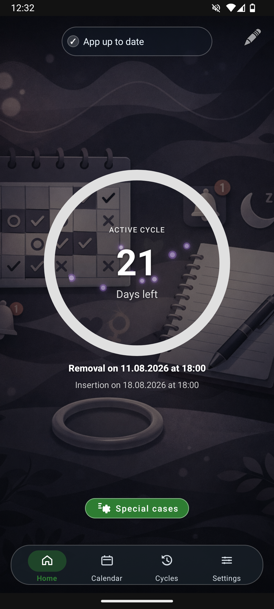
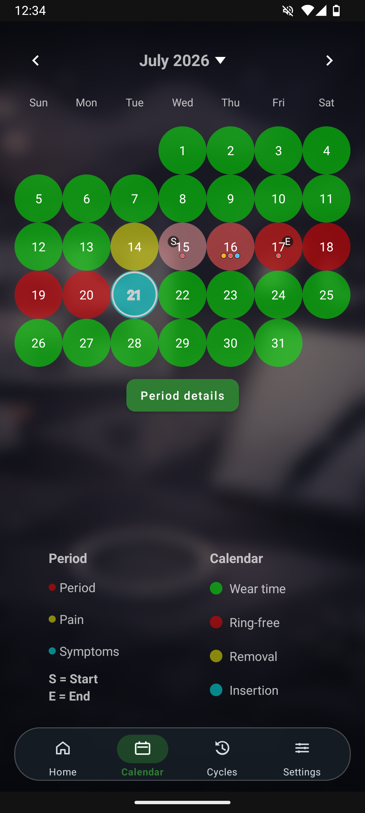
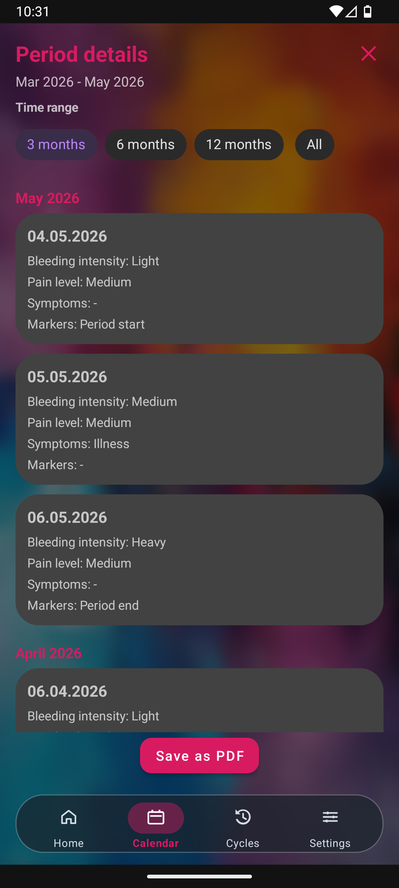
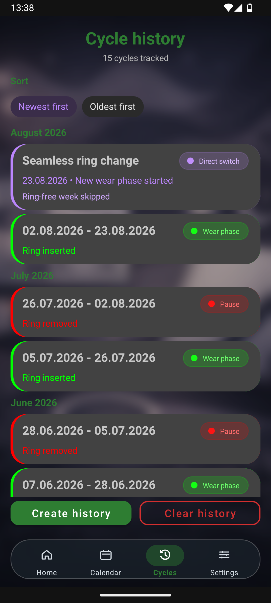
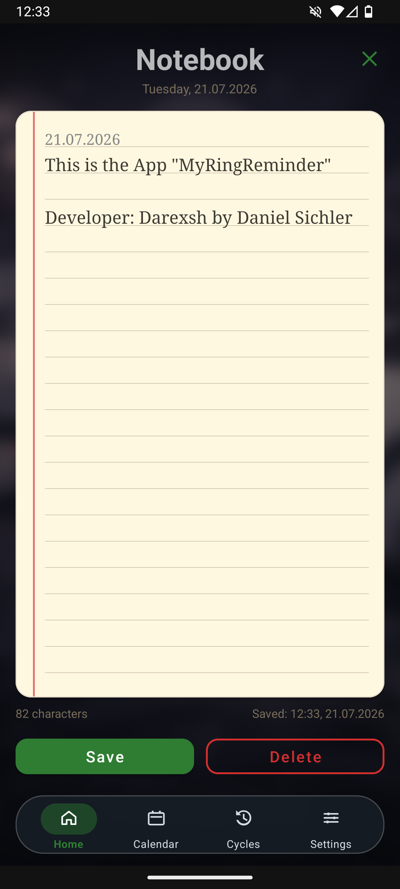
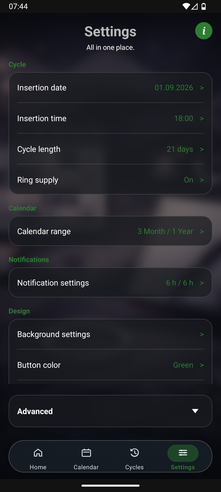
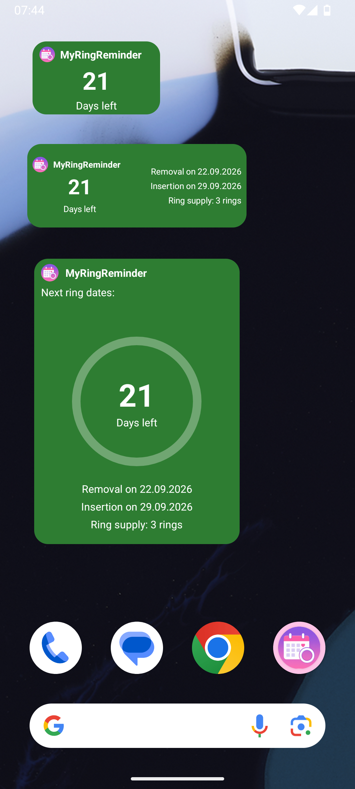
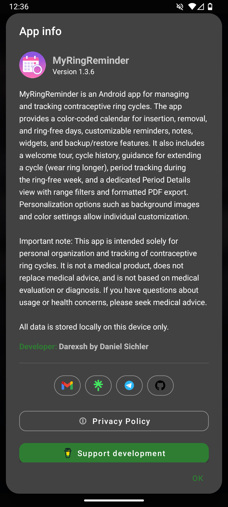

* * *

<div align="center">

<br>
<a href="https://git.io/typing-svg"></a>


[](https://t.me/darexsh_bot)
[](https://buymeacoffee.com/darexsh)
<br><sub>Get release updates on Telegram.<br>If you want to support more apps, you can leave a small donation for a coffee.</sub>

</div>

* * *

## ✨ Authors

| Name | GitHub | Role | Contact | Contributions |
| --- | --- | --- | --- | --- |
| **[Darexsh by Daniel Sichler](https://github.com/Darexsh)** | [Link](https://github.com/Darexsh?tab=repositories) | Android App Development 📱🛠️, UI/UX Design 🎨 | 📧 [E-Mail](mailto:sichler.daniel@gmail.com) | Concept, Feature Implementation, Calendar & Reminder Logic, Notes Management, UI Design |

* * *

## 🚀 Overview

**MyRingReminder** is a local-first Android app for people who want a clear, reliable, and discreet way to stay on top of contraceptive ring routines.

It combines cycle timing, reminders, period tracking during the ring-free window, history, notes, widgets, backup/restore, and thoughtful customization in one focused experience. The app is designed around quick visibility and low-friction use, so it stays informative without demanding constant interaction.

### Why MyRingReminder feels different

* Clear visual timing for insertion, removal, ring-free, and active days
* Reminder flow with vibration support and automatic rescheduling
* Period tracking integrated into the calendar only where it is actually useful
* Private local storage with backup/restore and no dedicated backend
* Flexible handling for real-life exceptions like longer wear or skipped ring-free weeks

**Important note:** This app is intended solely for personal organization and cycle tracking. It is not a medical product, does not replace medical advice, and is not based on medical evaluation or diagnosis. If you have usage questions or health concerns, seek professional medical advice.

* * *

## ✨ Feature Highlights

### Core Experience

* **Cycle Tracking**: Visualize insertion, removal, ring-free, and active days with color-coded calendar highlights, plus quick legend recoloring.
* **Reminders**: Set custom lead times for insertion and removal reminders, with automatic rescheduling and vibrating notifications.
* **Cycle History**: Review recorded cycles with month grouping, newest/oldest sorting, a tracked-cycle subtitle, clear/recreate controls, and rebuild support that respects saved special cases.
* **Notes**: Keep private notebook-style notes with autosave, character counter, and quick delete.

### Period Tracking

* **Period Tracking (Ring-Free Window)**: Add or edit period entries during the ring-free week and ±4 days, including bleeding intensity, pain level, symptoms, and optional start/end markers.
* **Period Details & PDF Export**: Open a dedicated details view for months with entries, switch between 3/6/12-month or full-history ranges, and export a polished PDF report with summary cards, highlights, a 3-column daily overview, and an extended notes area.
* **Search / Filter in Period Details**: Narrow entries live by text and quick filters such as symptoms, pain, and start/end markers across the currently selected range, including full-history view.

### Real-Life Flexibility

* **Wear Ring Longer**: Extend the current cycle by extra days, with built-in information guidance.
* **Skip Ring-Free Week**: Skip the current ring-free week for immediate reinsertion, then continue with normal cycle behavior afterward.
* **Special Cases Menu (Home)**: Access “Wear ring longer” and “Skip ring-free week” quickly from a compact, auto-hiding Home action menu.

### Convenience & Personalization

* **Backup / Restore**: Export and import local app data including settings, notes, cycle history, period tracking, and saved special cases, with validation and a readable restore preview.
* **Home Screen Widgets**: Choose between a small `2x1` widget, a compact `3x1` status widget, and a larger detailed widget for quick at-a-glance status, all color-synced with app settings.
* **Refined Home Status View**: See a clearer main status ring with subtle phase labeling, improved event hierarchy, cleaner spacing, and a conditional inner rain effect during active period days.
* **Customization**: Adjust cycle settings, reminder times, language, background image, calendar range, and accent colors through a grouped settings layout with modern list-style cards, including matching notification and background tools, plus widget, home ring, and calendar personalization.
* **Enhanced Calendar Navigation**: Move through months with arrows, jump directly by tapping the month header, and browse without a fixed scrolling limit.
* **Language Mode**: Choose between multiple app languages or **System Default**, with English fallback if the device language is unsupported.
* **App Lock**: Optional biometric or device-credential protection with configurable auto-lock delay.
* **App Updates**: Check for new releases inside the app, review version details, download the APK, and start installation directly from the update flow.
* **Welcome Tour**: A restartable first-run guided tour introduces the key screens and controls.
* **App Animations**: Choose a preferred global transition style for tab changes and screen openings.
* **Debug View**: Long-press the settings title to open detailed diagnostic information.

### Privacy-First by Design

* **Local-first storage**: Core data stays on the device.
* **No dedicated backend**: The app does not require a private server for cycle tracking.
* **User-controlled export**: Backups and PDF exports are created only when explicitly requested.

* * *

## 📸 Screenshots

An overview of the current visual experience across the app:

<table>
  <tr>
    <td align="center"><b>Home Screen</b><br></td>
    <td align="center"><b>Calendar</b><br></td>
    <td align="center"><b>Period Details</b><br></td>
    <td align="center"><b>Cycles</b><br></td>
  </tr>
</table>

<table>
  <tr>
    <td align="center"><b>Notes</b><br></td>
    <td align="center"><b>Settings</b><br></td>
    <td align="center"><b>Widgets</b><br></td>
    <td align="center"><b>About</b><br></td>
  </tr>
</table>

* * *

## 📥 Installation

### Build from source

1. Clone or download the repository:

   ```bash
   git clone https://github.com/Darexsh/MyRingReminder.git
   ```

2. Open the project in **Android Studio**.
3. Sync Gradle and build the project.
4. Run the app on an Android device or emulator.

### Install via APK

1. Download the provided APK from the repository (`myringreminder_app.apk`).
2. Allow installation from unknown sources if Android prompts you.
3. Open the APK on your device and follow the installation steps.

* * *

## 📝 Using the App

### 1. Set up the basics

* Open **Settings** and use the grouped cards to choose the insertion date, insertion time, cycle length, and reminder lead times.
* Optionally adjust language, background image, colors, calendar range, and other personalization options.
* If needed, restart the welcome tour from **Settings → Advanced**.

### 2. Use the calendar as your main view

* Open the **Calendar** tab to see color-coded cycle days:
  * 🟦 Cyan: Ring insertion
  * 🟨 Yellow: Ring removal
  * 🔴 Red: Ring-free days
  * 🟩 Green: Active cycle days
* Tap legend dots to change the colors.
* Use the left/right arrows to move between months.
* Tap the month label to choose a specific month and year.
* During ring-free week and ±4 days, tap a day to open **Period Entry** and save period details.
* If the selected month contains period entries, open **Period Details** to review grouped history, switch between 3/6/12-month or full-history ranges, use search and quick filters, or export a structured PDF report.

### 3. Let reminders handle the timing

* Receive vibrating notifications for insertion and removal based on your selected reminder times.

### 4. Add widgets for at-a-glance status

* Add the small `2x1`, compact `3x1`, or larger detailed widget to your home screen for quick status.
* The larger widget remains resizable from the launcher.

### 5. Track period entries when relevant

* During the ring-free window, save period details directly on calendar days.
* Use **Period Details** for grouped review, full-history lookup, search/filter, and PDF export.

### 6. Review cycle history

* Check the **Cycles** tab for recorded past cycles, grouped by month and sortable by newest or oldest first.
* Use **Clear history** to clear the list or **Create history** to rebuild it from saved cycle data.

### 7. Keep notes private

* Use the **Notes** tab to store private notes, automatically saved locally.

### 8. Back up or restore your data

* Use **Settings → Advanced** to export or import local app data such as settings, notes, cycle history, period tracking, and saved special cases.
* Before restore, review validated import content in an expandable, readable preview and confirm with **Yes/No**.

### 9. Handle special cases

* Tap **Special cases** on the Home screen to open quick actions.
* Use **Wear ring longer** to extend only the current cycle.
* Use **Skip ring-free week** to set immediate reinsertion for the current cycle.
* Tap the **info** icon next to **Wear ring longer** or **Skip ring-free week** for additional guidance.

### 10. Keep the app up to date

* Use the update entry in **Settings → Advanced** or the update card on the Home screen to check for newer app versions.
* If an update is available, the app can download the APK and prompt installation directly.

### 11. Enable optional security

* Open **Settings → Advanced → App lock**.
* In the popup, enable or disable app lock and set the auto-lock delay.
* Unlock uses biometric authentication or device PIN/pattern/password.

* * *

## 🔑 Permissions

* **Storage / Media Access**: Required to select a custom background image and to create/restore backups or export PDFs through Android's file picker.
* **Notifications**: Required to receive cycle reminders.
* **Exact Alarms**: Used to schedule precise reminder notifications.
* **Biometric / Device Credential**: Used for optional app lock authentication.
* **Internet**: Used to check GitHub release information for in-app update checks.
* **Install Packages**: Used to hand off a downloaded update APK to Android's package installer.

* * *

## ⚙️ Technical Details

* Built with **Java** using an **Android MVVM** architecture.
* Calendar rendering and cycle logic are computed locally.
* Local app state such as settings, notes, cycle history, period tracking, and special-case flags is stored in **SharedPreferences**.
* In-app update checks use the public **GitHub Releases API**, and downloaded APK installation is handed off to Android's package installer.
* Notifications are implemented with **BroadcastReceiver** and **NotificationManagerCompat**.
* Period reports are generated locally with **PdfDocument** and exported through Android's document picker API, including grouped summary cards, multi-column day cards, and a larger notes section.
* Shared state between fragments is managed with **SharedViewModel** and **LiveData**.
* Home-screen widgets are implemented via **AppWidgetProvider**.
* Core user data remains stored locally on the device.

* * *

## 🔒 Privacy

* Privacy Policy: [PRIVACY_POLICY.md](PRIVACY_POLICY.md)

* * *

## 📜 License

This project is licensed under the **Non-Commercial Software License (MIT-style) v1.0** and was developed as an educational project. You are free to use, modify, and distribute the code for **non-commercial purposes only**, and must credit the author:

**Copyright (c) 2025 Darexsh by Daniel Sichler**

Please include the following notice with any use or distribution:

> Developed by Daniel Sichler aka Darexsh. Licensed under the Non-Commercial Software License (MIT-style) v1.0. See `LICENSE` for details.

The full license is available in the [LICENSE](LICENSE) file.

* * *

<div align="center"><sub>Created with ❤️ by Daniel Sichler</sub></div>
